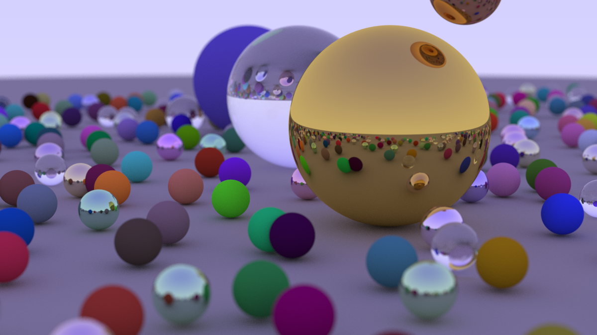

# Monte Carlo Path Tracer

A Monte Carlo path tracer designed to be run multithreaded on CPU and GPU with metrics for benchmarking.

### Progression:


### Final render



## Build

Install OpenMP with
```bash
brew install libomp
```

Then build
```bash
cmake -S . -B build -DCMAKE_BUILD_TYPE=Release -BUILD_VIEWER
cmake --build build -j
```

If the CUDA toolkit is detected, an extra `cuda_renderer` GPU executable is built and
the viewer is linked with a GPU backend. Without CUDA the project builds CPU-only.

## Run

### Offline render

```bash
./build/inOneWeekend
```

### Offline benchmark mode

```bash
./build/inOneWeekend --benchmark
```

### CUDA render (requires NVIDIA GPU)

```bash
./build/cuda_renderer            # GPU render
./build/cuda_renderer --cuda     # explicit GPU path
./build/cuda_renderer --benchmark  # CPU vs OpenMP vs CUDA comparison
```

### Real-time viewer

```bash
./build/viewer
```

Controls:
- WASD - move
- Shift / Space - down / up
- Right mouse drag - look around
- C - toggle CPU / CUDA backend (when built with CUDA)

## Results

Benchmark scene rendered at 400 x 225, 50 samples/pixel, max depth 50, on an Apple M1 MacBook.

| Backend | Threads | Render time | Throughput | Speedup |
|---------|--------:|------------:|-----------:|--------:|
| Single-threaded CPU | 1 | 13.20 s | 0.34 Mrays/s | 1.00x |
| OpenMP CPU | 8 | 3.37 s | 1.34 Mrays/s | 3.92x |

Same scene on a Google Colab instance (NVIDIA T4 GPU, 2-core CPU), 400 x 225, 50 samples/pixel, max depth 50.

| Backend | Threads | Render time | Throughput | Speedup |
|---------|--------:|------------:|-----------:|--------:|
| Single-threaded CPU | 1 | 27.41 s | 0.16 Mrays/s | 1.00x |
| OpenMP CPU | 2 | 24.73 s | 0.18 Mrays/s | 1.11x |
| CUDA GPU | 90000 | 0.33 s | 13.82 Mrays/s | 83.06x |

## Credits

Project based on Peter Shirley's *Ray Tracing in One Weekend* series.
