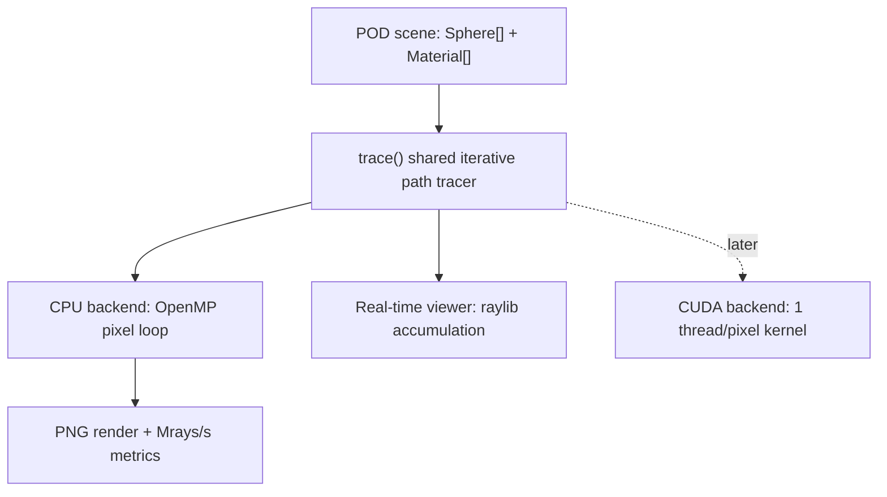

# Monte Carlo Path Tracer

A Monte Carlo path tracer inspired by *Ray Tracing in One Weekend*, refactored to be run multithreaded on CPU with metrics for benchmarking.


## Build

Install OpenMP with
```bash
brew install libomp
```

Then build
```bash
cmake -S . -B build -DCMAKE_BUILD_TYPE=Release -BUILD_VIEWER
cmake --build build -j
```

## Run

### Offline render

```bash
./build/inOneWeekend
```

### Offline benchmark mode

```bash
./build/inOneWeekend --benchmark
```

### Real-time viewer

```bash
./build/viewer
```

Controls:
- WASD - move
- Shift / Space - down / up
- Right mouse drag - look around


## Architecture



## Results 
Single-threaded CPU
  Resolution:     400 x 225
  Samples/pixel:  50
  Max depth:      50
  Threads:        1
  Render time:    13.20 s
  Throughput:     0.34 Mrays/s
OpenMP CPU
  Resolution:     400 x 225
  Samples/pixel:  50
  Max depth:      50
  Threads:        8
  Render time:    3.37 s
  Throughput:     1.34 Mrays/s

Speedup: 3.92x
Wrote images/final_scene.png
On M1 Macbook

## Credits

Project based on Peter Shirley's *Ray Tracing in One Weekend* series.
